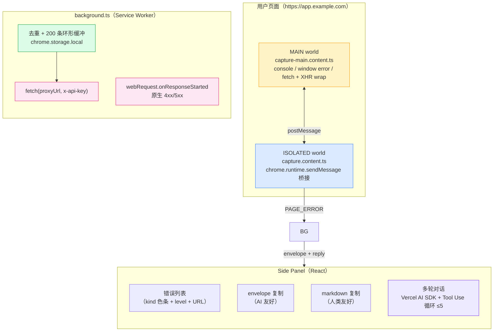

<div align="center">

English | [简体中文](README.md)

# 🛠️ Chrome Page Fixer

**捕获浏览器错误 → 交给 AI → 直接拿到修复方案。**

一款基于 Manifest V3 的 Chrome 扩展。它在 **MAIN world** 直接监听页面（React / Vue / SPA 框架错误一个不漏），把每条异常打包成结构化的 **envelope**，再配合内置的 AI Agent——通过 Side Panel 就能让模型读取你的 DOM、控制台、网络请求与本地存储。

<p>
  <a href="LICENSE"></a>
  
  
  
  
  
</p>

</div>

---

## ✨ 为什么做这个

> 你打开一个页面，它崩了。控制台里是一大段乱码。你复制给 Claude，模型回问："什么路由？哪个请求？刚才聚焦的是哪个元素？"——你也答不上来。

**Chrome Page Fixer 解决的就是这个"捕获"环节。**

它监听了所有 `console.*`、未捕获异常、未处理 Promise Reject、4xx/5xx 网络请求、`` 502、XHR 失败——并把它们打包成一份结构化的 **envelope**，模型一眼就能读懂。Agent 还内置了 12 个只读 Tool（DOM / 控制台缓冲 / 网络日志 / 资源时序 / 存储快照 / 事件监听 / 页面 HTML / 导航时序），不需要你再去手动补充上下文。

> [!IMPORTANT]
> **隐私优先。** 错误日志只存在 `chrome.storage.local`。所有网络请求 **只** 发往你配置的 Proxy URL。无遥测、无远端代码加载、无任何意外行为。

---

## 📸 一览

<div align="center">
<table>
<tr>
<td align="center" width="33%"><strong>Side Panel</strong><br/><br/></td>
<td align="center" width="33%"><strong>Options</strong><br/><br/></td>
<td align="center" width="33%"><strong>AI Envelope</strong><br/><br/></td>
</tr>
</table>
</div>

---

## 🚀 核心能力

| | 能力 |
| --- | --- |
| 🎯 | **MAIN-world 捕获** —— 在页面自己的 JS 上下文里安装监听，React / Vue / 框架错误不会消失在隔离世界里 |
| 📦 | **结构化 envelope** —— 每条错误都包含 kind / level / route / page-title / viewport / focused element / source / stack，可直接喂给任何 Agent |
| 🌐 | **网络故障全覆盖** —— `webRequest` 4xx/5xx + `fetch` / `XMLHttpRequest` 拦截 + 原生资源加载失败（`` 502、`<script>` 404） |
| 🖱️ | **DOM 触发上下文** —— 网络错误会附带最近一次 `click` / `submit` / `keydown` 的 `triggerSelector` / `triggerElement` |
| 💬 | **多轮对话** —— 多轮间使用稳定的 `#N` 引用；"问他"会复用最近引用过同一 hash 的会话 |
| � | **12 个只读 Tool** —— Agent 可枚举错误、查询 DOM、读取控制台 / 网络 / 存储 / 资源时序 / 事件监听 / 页面 HTML / 导航时序 |
| 🛡️ | **Tool runner 硬上限** —— `stopWhen: stepCountIs(5)`；无写操作 Tool、无远端代码、不违反 Manifest V3 |
| 🔐 | **BYOK + 自定义 Proxy** —— 你的 API Key、你的网关、Anthropic Messages 协议，绝不外发 |

---

## ⚡ 快速上手

### 1. 安装与构建

```bash
pnpm install
pnpm build
```

产物输出到 `.output/chrome-mv3/`。在 `chrome://extensions` 打开**开发者模式**，加载已解压的扩展即可。

### 2. 打开 Side Panel

点击扩展图标（拼图）→ **Chrome Page Fixer** → **固定**。Side Panel 会出现三个标签页：**错误 / 对话 / 历史**。

### 3. 触发一条错误，交给 Agent

在浏览器里打开 `tests/error-pages/index.html`，你会看到三条记录（console error / uncaught throw / unhandled rejection）。点 **Analyze recent 5**，扩展会把 envelope 发往你配置的 Proxy，Agent 直接在 Side Panel 内回复，可继续追问。

> [!TIP]
> **默认配置下 Agent 不会说话。** Proxy URL 默认 `http://127.0.0.1:5000/v1`，API Key 默认 `PROXY_MANAGED`。请先到 Options 里完成配置。

---

## 🧰 12 个只读 Tool

Agent 不靠猜——它直接问页面。每个 Tool 都是只读、由 `zod` 做 schema 校验，并由 `stopWhen: stepCountIs(5)` 把循环卡死在 5 轮以内。

| Tool | 数据源 | 回答什么 |
| --- | --- | --- |
| `get_errors` | error buffer | 按 kind / level / 关键词列出捕获的错误 |
| `get_error_by_index` | error buffer | 用稳定的 `#N` 拉取完整 `ErrorEntry` |
| `search_errors_by_message` | error buffer | 对 message / selector 做子串检索 |
| `inspect_element` | DOM | tag / id / class / 受限 attribute 白名单 / rect —— **绝不** 返回 `textContent` / `innerHTML` |
| `list_elements` | DOM | 扁平计数或带深度的骨架树 |
| `get_console_messages` | console buffer | `console.log` / `info` / `warn` / `error` 历史 |
| `get_network_log` | webRequest buffer | 4xx/5xx 历史，含 URL + 状态码 |
| `get_resource_timing` | `PerformanceObserver` | 每个资源的加载时序 |
| `get_computed_style` | DOM | 12 个默认 `getComputedStyle` 属性或自定义列表 |
| `get_storage_snapshot` | `localStorage` / `sessionStorage` | 键 + 值（默认 `***` 脱敏，可用 `properties` 加白名单） |
| `get_event_listeners` | DOM（启发式） | 内联 `on*` 属性 + 捕获到的触发器 |
| `get_page_dom_html` | DOM | `documentElement.outerHTML`，带 `maxLength`（默认 8000） |
| `get_navigation_timing` | `PerformanceNavigationTiming` | TTFB / DOMContentLoaded / load / FCP |

> [!NOTE]
> `:root` / `html` / `body` / `*` 这类选择器在桥接层就被拒掉。`inspect_element` 只返回结构、不返回内容——**隐私在 schema 层就拦住，而不是只在运行时兜底**。

---

## 🏗️ 架构



**三个世界，一次对话：**

1. **MAIN world** 包装 `console.*`、`window.onerror`、`unhandledrejection`、`fetch`、`XMLHttpRequest`——现代 SPA 里这些异常只会在这里触发。
2. **ISOLATED world** 通过 `chrome.runtime.sendMessage` 把 payload 中继给 Service Worker，跳出页面 JS 上下文。
3. **Service Worker** 去重、200 条环形缓冲、持久化到 `chrome.storage.local`，并在对话发起时供 Agent 读取。
4. **Side Panel** 渲染列表、复制 envelope，并跑 Vercel AI SDK 的 12-Tool + 5 轮上限循环。

---

## ⚙️ 配置

从 `chrome://extensions` → *扩展选项* 打开 **Options**，或者从 Side Panel 状态栏进入。

| 字段 | 默认值 | 行为 |
| --- | --- | --- |
| API Key | `PROXY_MANAGED` | 作为 `x-api-key` 发送。替换成你的网关 Token。 |
| Proxy URL | `http://127.0.0.1:5000/v1` | 必须接受 **Anthropic Messages** 协议。保存时会自动剥掉末尾的 `/messages`。 |
| App Hint | _（留空）_ | 告诉 Agent 你的项目根目录，方便它本地核对正确的文件。 |

> [!WARNING]
> **Proxy URL 必须指向 Messages 端点。** 粘贴 `http://127.0.0.1:5000/v1/messages` 或 `http://127.0.0.1:5000/v1` 都行，扩展会自动归一化。

---

## 🧪 验证

两份 Checklist 都在 `docs/qa/` 下：

- `e2e-verification-phase1-4.md` —— 捕获 / 复制 / BYOK / Agent 路径（MVP 到 Phase 4）。
- `agent-e2e-checklist.md` —— 12 个只读 Tool 的 23 场景矩阵。

---

## �️ Roadmap

### ✅ 已交付

- MVP（Phase 1–4）：脚手架 → 捕获 → 复制 → AI envelope → BYOK + Proxy
- 网络错误捕获：`chrome.webRequest` + `fetch` / `XHR` 拦截
- AI-friendly envelope：kind / level / route / viewport / focused element / source / stack
- 多轮对话：稳定 `#N` 引用 + 按 error hash 复用会话
- 网络错误携带 `triggerSelector` / `triggerElement`（跨域场景如实标注）
- 4 个只读 Tool + 手写循环（`get_errors` / `get_error_by_index` / `search_errors_by_message` / `inspect_element`）—— tag `v-pre-ai-sdk`
- **迁移到 Vercel AI SDK v7 + `@ai-sdk/anthropic` v4 + `zod` v4**，`stopWhen: stepCountIs(5)`；手写循环已删除
- 新增 8 个只读 Tool（`list_elements` / `get_console_messages` / `get_network_log` / `get_resource_timing` / `get_computed_style` / `get_storage_snapshot` / `get_event_listeners` / `get_page_dom_html` / `get_navigation_timing`）
- System Prompt 重写：三角循环心智模型 + 12-Tool 能力地图 + "envelope 与 Tool 并列、按用户问题走，不先 envelope 后 Tool"边界
- Bundle 影响：`background.js` 26 → 413 kB——一次性接受，换得 L2 决策层能力

### 🔜 计划中

- 基于本地仓库路径的 source-map 栈解析
- 最近操作时间线（点击 / 输入，最多 5 条），用于复现路径
- 写操作 Tool + 域名白名单 + 二次确认 + 操作审计（依据 `docs/constraint/agent-safety.md`）

---

## ⚠️ 已知限制

- `` 502 通过 `chrome.webRequest` 捕获，需要 `host_permissions: ["<all_urls>"]`。我们接受这个代价，因为纯 JS 路径漏掉这一类。
- Proxy URL 必须 **兼容 Anthropic Messages**——这就是我们说的协议。换 Provider 意味着换 `entrypoints/agent/provider.ts` 里的 SDK Adapter，Proxy 契约不变。
- 暂未开启流式回复，当前是单次往返。
- `get_event_listeners` 是启发式实现：能看到内联 `on*` 属性和捕获到的触发器，但 **不识别** `addEventListener` 回调或框架的虚拟事件。

---

## 🤝 参与

欢迎提 Issue 与 PR。先读一遍 `docs/qa/`，理解约束模型与"证据分级"原则。每次变更必须满足：

1. 通过 `pnpm typecheck` 与 `pnpm build`。
2. `manifest.json` 权限保持在 `docs/constraint/manifest-permissions.md` 之内。
3. **绝不运行时加载远端代码**——Manifest V3 政策。
4. 任何架构决策都在 `docs/qa/` 下新增或更新一条记录。
5. 新 Tool 必须先在 `docs/constraint/tool-design.md` 注册，才能合并。

---

## 📄 License

Apache License 2.0 —— 见 [LICENSE](LICENSE)。

Copyright 2026 SoftMeng / xiangyuanmeng.

<div align="center">

<sub>Built with 🛠️ —— by 那些宁可读 envelope、也不愿读截图的人。</sub>

</div>
