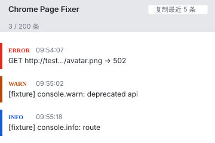
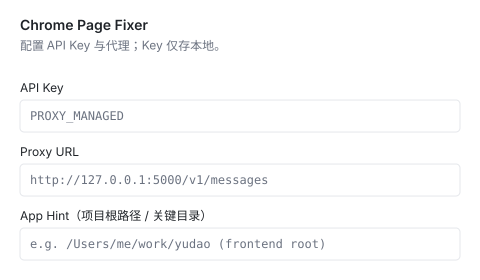
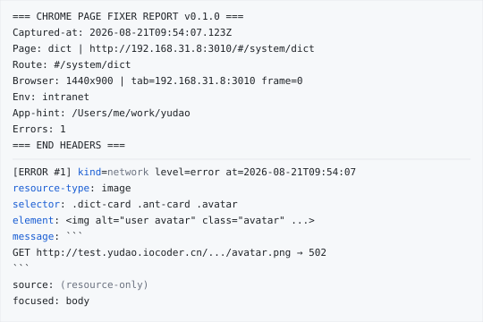
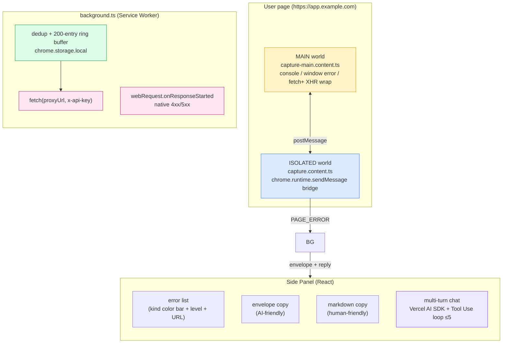

<div align="center">

English | [简体中文](README.md)

# 🛠️ Chrome Page Fixer

**Capture browser errors, hand them to AI, get a fix.**

A Manifest V3 Chrome extension that captures page errors straight from the **main world** (so React/Vue/SPA failures never slip past), wraps them in a machine-readable **envelope**, and pairs them with a built-in agent that can read your DOM, console, network, and storage — all without leaving the Side Panel.

<p>
  <a href="LICENSE"></a>
  
  
  
  
  
</p>

</div>

---

## ✨ Why this exists

You load a page. It crashes. The browser console is a wall of text. You copy it into Claude, and the model asks: *"what route? what request? what was the focused element?"* — and you don't know.

**Chrome Page Fixer fixes the capture half of that loop.**

It watches every `console.*`, every uncaught exception, every unhandled rejection, every 4xx/5xx fetch, every `` 502, every failed XHR — and packages them as a single, structured **envelope** the model can read at a glance. Then the built-in agent asks back via 12 read-only Tools (DOM, console buffer, network log, resource timing, storage snapshot, event listeners, page HTML, navigation timing) so you don't have to.

> [!IMPORTANT]
> **Privacy first.** Errors stay in `chrome.storage.local`. Network calls go **only** to the proxy URL you configure. No telemetry, no remote bundle, no surprises.

---

## 📸 At a glance

<div align="center">
<table>
<tr>
<td align="center" width="33%"><strong>Side Panel</strong><br/><br/></td>
<td align="center" width="33%"><strong>Options</strong><br/><br/></td>
<td align="center" width="33%"><strong>AI Envelope</strong><br/><br/></td>
</tr>
</table>
</div>

---

## 🚀 Features

| | Capability |
| --- | --- |
| 🎯 | **MAIN-world capture** — installs in the page's own JS context, so React/Vue/framework errors don't vanish into the isolated world |
| 📦 | **Structured envelope** — every error becomes kind / level / route / page-title / viewport / focused element / source / stack — paste-ready for any agent |
| 🌐 | **Network fault coverage** — `webRequest` 4xx/5xx + `fetch` / `XMLHttpRequest` wrapper + native resource failures (`` 502, `<script>` 404) |
| 🖱️ | **DOM trigger context** — network errors carry the most recent `click` / `submit` / `keydown` target as `triggerSelector` / `triggerElement` |
| 💬 | **Multi-turn chat** — stable `#N` references across turns; "问他" reuses the session that last cited the same error hash |
| 🤖 | **12 read-only Tools** — the agent can enumerate errors, query DOM, read console / network / storage / resource timing / event listeners / page HTML / navigation timing |
| 🛡️ | **Tool runner hard cap** — `stopWhen: stepCountIs(5)`; no write paths, no remote code, no Manifest V3 violations |
| 🔐 | **BYOK + custom proxy** — your API key, your gateway, Anthropic Messages protocol; never sent anywhere else |

---

## ⚡ Quick start

### 1. Install & build

```bash
pnpm install
pnpm build
```

Output lands in `.output/chrome-mv3/`. Load it as an unpacked extension at `chrome://extensions` (Developer mode on).

### 2. Open the Side Panel

Click the puzzle icon → **Chrome Page Fixer** → **Pin**. The Side Panel opens with three tabs: **Errors**, **Chat**, **History**.

### 3. Trigger an error & hand it to the agent

Open `tests/error-pages/index.html` in the loaded browser. You'll see three entries (console error, uncaught throw, unhandled rejection). Hit **Analyze recent 5** — the extension posts the envelope to your proxy and the agent replies in-place, ready to follow up.

> [!TIP]
> **Defaults are no-ops until you opt in.** Proxy URL defaults to `http://127.0.0.1:5000/v1`, API Key defaults to `PROXY_MANAGED`. Configure both in Options before expecting the agent to talk back.

---

## 🧰 The 12 read-only Tools

The agent doesn't guess — it asks the page directly. Every Tool is read-only, schema-validated by `zod`, and capped at 5 loop iterations by `stopWhen: stepCountIs(5)`.

| Tool | Source | What it answers |
| --- | --- | --- |
| `get_errors` | error buffer | List captured errors by kind / level / query |
| `get_error_by_index` | error buffer | Fetch full `ErrorEntry` by stable `#N` |
| `search_errors_by_message` | error buffer | Substring search across message / selector |
| `inspect_element` | DOM | Tag / id / class / attribute whitelist / rect — **never** `textContent` / `innerHTML` |
| `list_elements` | DOM | Flat count or tree skeleton, depth-controlled |
| `get_console_messages` | console buffer | `console.log` / `info` / `warn` / `error` history |
| `get_network_log` | webRequest buffer | 4xx/5xx history with URL + status |
| `get_resource_timing` | `PerformanceObserver` | Per-resource load timing |
| `get_computed_style` | DOM | 12 default `getComputedStyle` properties or custom list |
| `get_storage_snapshot` | `localStorage` / `sessionStorage` | Keys + values (default `***` redaction, whitelist via `properties`) |
| `get_event_listeners` | DOM (heuristic) | Inline `on*` attributes + captured triggers |
| `get_page_dom_html` | DOM | `documentElement.outerHTML` with `maxLength` (default 8000) |
| `get_navigation_timing` | `PerformanceNavigationTiming` | TTFB / DOMContentLoaded / load / FCP |

> [!NOTE]
> `:root` / `html` / `body` / `*` selectors are rejected at the bridge. `inspect_element` returns structure, not content — privacy is enforced at the schema layer, not just at runtime.

---

## 🏗️ Architecture



Three worlds, one conversation:

1. **MAIN world** wraps `console.*`, `window.onerror`, `unhandledrejection`, `fetch`, and `XMLHttpRequest` — the only place those errors actually fire in modern SPAs.
2. **ISOLATED world** relays the payload to the Service Worker via `chrome.runtime.sendMessage`, breaking out of the page's JS context.
3. **Service Worker** dedups, ring-buffers (200 entries), persists to `chrome.storage.local`, and serves the agent when chat starts.
4. **Side Panel** renders the list, copies envelopes, and runs the Vercel AI SDK loop with 12 Tools and a 5-step cap.

---

## ⚙️ Configuration

Open **Options** from `chrome://extensions` → *Extension options*, or from the Side Panel status row.

| Field | Default | Behaviour |
| --- | --- | --- |
| API Key | `PROXY_MANAGED` | Sent as `x-api-key`. Replace with your gateway token. |
| Proxy URL | `http://127.0.0.1:5000/v1` | Must accept **Anthropic Messages** protocol. Trailing `/messages` is auto-stripped on save. |
| App Hint | _(empty)_ | Tells the agent where your project root is, so it can locally inspect the right files. |

> [!WARNING]
> The proxy URL **must point at the Messages endpoint**. Paste `http://127.0.0.1:5000/v1/messages` or `http://127.0.0.1:5000/v1` — both work; the extension normalises.

---

## 🧪 Verification

Two checklists live in `docs/qa/`:

- `e2e-verification-phase1-4.md` — capture / copy / BYOK / agent path (MVP through Phase 4).
- `agent-e2e-checklist.md` — 23-scenario grid for the 12 read-only Tools.

---

## 🗺️ Roadmap

### ✅ Shipped

- MVP (Phases 1–4): scaffold → capture → copy → AI envelope → BYOK + proxy
- Network error capture via `chrome.webRequest` + `fetch`/`XHR` interception
- AI-friendly envelope: kind, level, route, viewport, focused element, source, stack
- Multi-turn chat with stable `#N` references and session reuse by error hash
- `triggerSelector` / `triggerElement` on network errors (cross-origin cases honestly labelled)
- 4 read-only Tools on a hand-rolled loop (`get_errors` / `get_error_by_index` / `search_errors_by_message` / `inspect_element`) — tag `v-pre-ai-sdk`
- **Migrated to Vercel AI SDK v7** + `@ai-sdk/anthropic` v4 + `zod` v4 — `stopWhen: stepCountIs(5)`; hand-rolled loop deleted
- 8 additional read-only Tools (`list_elements` / `get_console_messages` / `get_network_log` / `get_resource_timing` / `get_computed_style` / `get_storage_snapshot` / `get_event_listeners` / `get_page_dom_html` / `get_navigation_timing`)
- System-prompt rewritten: triangle-loop thinking, 12-Tool capability map, "envelope or tool — never speculate" boundary
- Bundle impact: `background.js` 26 → 413 kB — accepted once for L2 decision-layer capabilities

### 🔜 Planned

- Source-map-aware stack resolution against a local repo path
- Recent-action timeline (clicks / inputs, max 5) for reproduction paths
- Write-side Tools with domain allow-list + second-confirm + audit (per `docs/constraint/agent-safety.md`)

---

## ⚠️ Known limitations

- `` 502 is captured via `chrome.webRequest`, which requires `host_permissions: ["<all_urls>"]`. We accept this trade-off because JS-only paths miss it.
- The proxy URL must be **Anthropic Messages** compatible — that's the wire format we speak. Swapping providers means swapping the SDK adapter in `entrypoints/agent/provider.ts`; the proxy contract stays the same.
- No stream mode yet. The current reply is a single round-trip.
- `get_event_listeners` is heuristic — it sees inline `on*` attributes and captured triggers, but **not** `addEventListener` callbacks or framework-virtual events.

---

## 🤝 Contributing

Issues and PRs welcome. Read `docs/qa/` first to understand the constraint model and the evidence-grading principle. Every change must:

1. Pass `pnpm typecheck` and `pnpm build`.
2. Keep `manifest.json` permissions inside `docs/constraint/manifest-permissions.md`.
3. **Never load remote code at runtime** — Manifest V3 policy.
4. Add or update a QA record under `docs/qa/` for any new architectural decision.
5. Register any new Tool in `docs/constraint/tool-design.md` before merging.

---

## 📄 License

Apache License 2.0 — see [LICENSE](LICENSE).

Copyright 2026 SoftMeng / xiangyuanmeng.

<div align="center">

<sub>Built with 🛠️ by people who'd rather debug an envelope than a screenshot.</sub>

</div>